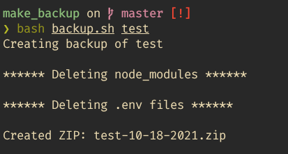

# Code Backup Bash Script

The project is a bash script that creates a zip backup of a node project. It deletes `node_modules`, `.git`, `.env`, `.vs`.

### Setup
```shell
# clone this repo
git clone https://github.com/prashantacharya/code-backup-script.git

# Navigate inside the directory
cd code-backup-script

# Copy the script to usr/bin
cp backup.sh /usr/bin/backup-code
# we can use backup-code command on our terminal after this

# Give executable permission to the script
chmod a+x /usr/bin/backup-code
```

### Usage

```shell
bash backup.sh project_directory_name backup_file_name

# Example
bash backup.sh test_folder test
# test.zip will be created
```


> Note: If backup file name is not supplied, the backup file name will have a default name in the format `project_directory_name-date.zip`
